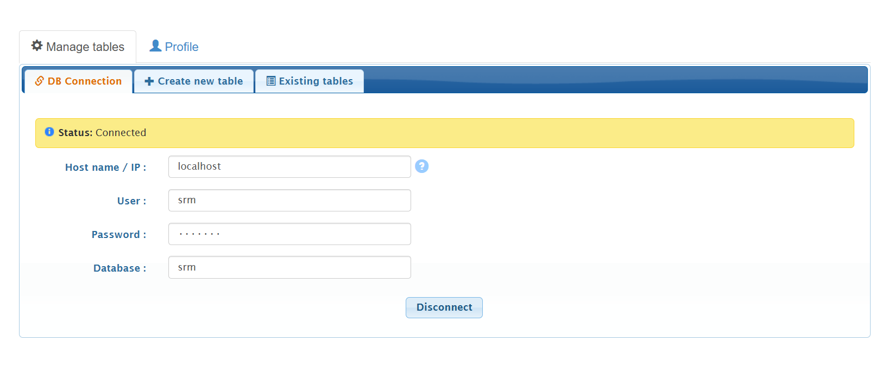

# 📊 Smart Pivot Table (MPT)

**Smart Pivot Table** is now a **free** and **open-source** PHP tool for building **MySQL Pivot Tables** visually — with **no coding required**.

It offers a fully **manual, user-controlled experience**, allowing you to:

- **Select your database connections** visually
- Define **data sources**
- Assign fields to **rows**, **columns**, and **values** with ease

Built entirely using **native PHP**, it’s lightweight, easy to set up, and released under the **MIT License** — giving you full freedom to **use**, **modify**, and **distribute** it even in commercial projects.

👉 However, if you’re looking for a **more advanced** and **modern** experience — including a **drag-and-drop pivot table builder**, dynamic filters, and enhanced features — check out the latest module in Smart Report Maker:  
[https://mysqlreports.com/php-mysql-pivot-tables/](https://mysqlreports.com/php-mysql-pivot-tables/)

---

## 🚀 Getting Started

### 🔧 Installation

To install **Smart Pivot Table**:

- Place the `MPT` directory inside a folder located within your web server's root directory (e.g., `htdocs` or `www`).
- Open your browser and navigate to it:

  `localhost/path-to-MPT/MPT`

- This should take you to the login setup page:

  `localhost/path-to-MPT/MPT/wizard/login.php?from=setconfig`

---

### 📝 Signup Page

You’ll see a signup page where you can create your **Admin profile**.

---

### 👤 Create Your Admin Account

After signing up:

- The system will instruct you to delete the signup file for security reasons.
- Once done, log in using the Admin account you created.

---

### 🧩 Build Pivot Tables with Ease

After logging in, you’ll be greeted with a simple, intuitive interface to visually build your MySQL Pivot Tables.

---

## 🛠 Need More Features?

If you need advanced filtering options, custom parameters, or a more powerful pivot table builder, check out the upgraded module in Smart Report Maker:

[Explore our drag-and-drop editor for building MySQL Pivot Tables effortlessly.](https://mysqlreports.com/php-mysql-pivot-tables/)

